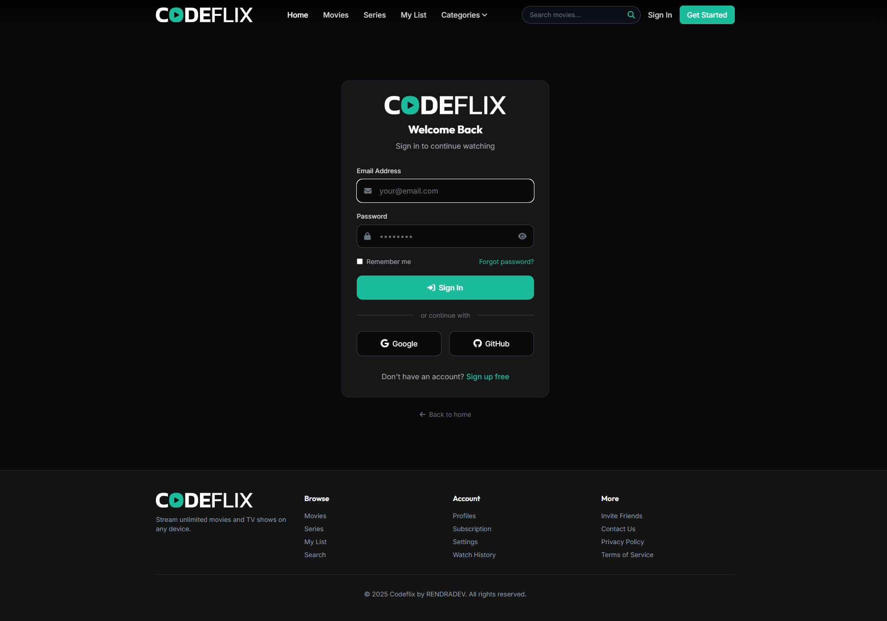
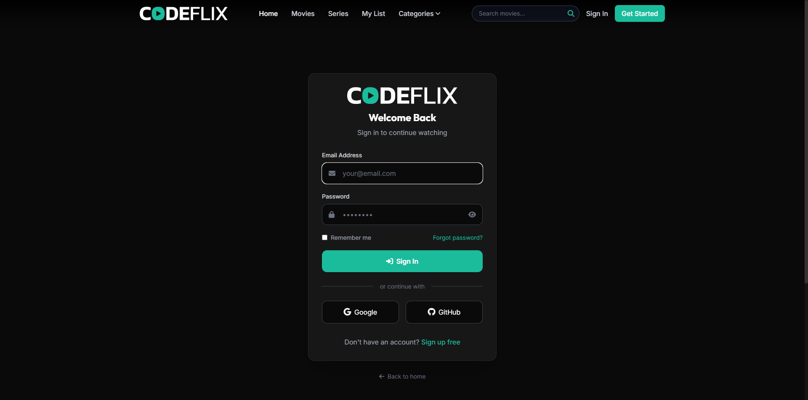
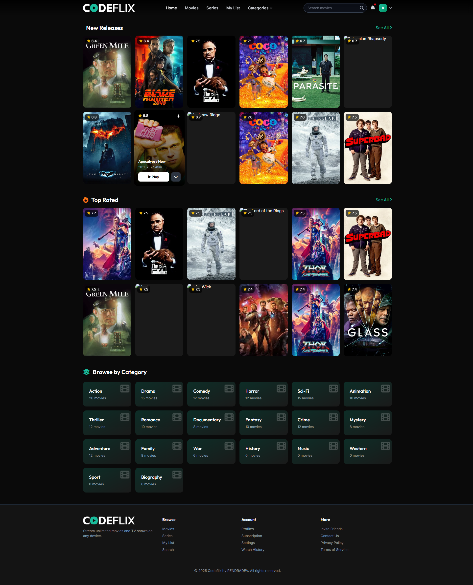
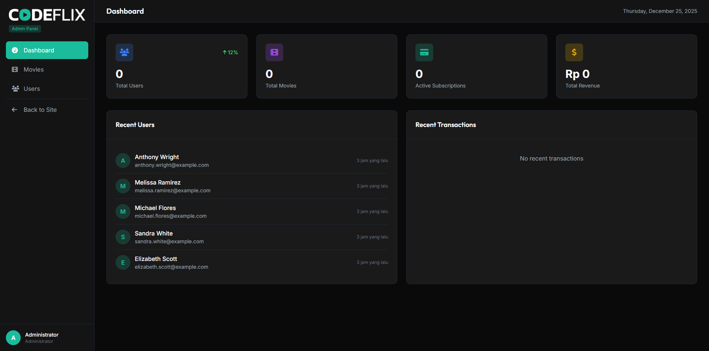

# Codeflix - Advanced Video Streaming Platform



**Codeflix** is a feature-rich, scalable video streaming application built with **Laravel 12**. Designed to emulate the core functionalities of Netflix, it offers a robust architecture featuring multi-profile user accounts, subscription-based access, comprehensive admin management, and a high-performance infrastructure using Redis, MinIO, and Meilisearch.

## 🚀 Key Features

### 👤 User Experience

- **Multi-Profile System:** Users can create up to 5 profiles per account (including Kids mode) with independent watch history and lists.
- **Smart Recommendations:** Integrated with TMDB API to fetch similar movies and personalized content suggestions.
- **Interactive Player:** Custom video player with resume capability, "Continue Watching", and progress tracking.
- **Watchlist:** Personal "My List" for saving movies and series.
- **Responsive Design:** Fully responsive UI built with Tailwind CSS and Alpine.js for a fluid mobile and desktop experience.

### 🛠️ Technical Implementation

- **Authentication & Security:** Robust auth system using Laravel Fortify.
- **External API:** Seamless integration with **TMDB API** for movie recommendations and metadata.
- **High Performance:**
    - **Redis:** Used for Session management, Caching, and Queues.
    - **Meilisearch:** Blazing fast full-text search engine for movies and series.
- **Storage:** S3-compatible object storage via **MinIO** for media assets.
- **Email System:** Transactional emails tested with **Mailpit**.

### 👑 Administration

- **Comprehensive Dashboard:** Real-time stats on users, subscriptions, and revenue.
- **Content Management:** Full CRUD for Movies, Series, Episodes, Cast, and Categories.
- **User Management:** detailed user insights and role management.

---

## 🏗️ Technology Stack

| Component         | Technology                     | Description                             |
| :---------------- | :----------------------------- | :-------------------------------------- |
| **Framework**     | Laravel 12                     | The PHP Framework for Web Artisans      |
| **Frontend**      | Blade, Tailwind CSS, Alpine.js | Modern, reactive, and utility-first UI  |
| **Database**      | MySQL 8.x                      | Relational data storage                 |
| **Cache/Session** | Redis                          | High-performance in-memory data store   |
| **Queue**         | Redis                          | Background job processing               |
| **Search**        | Meilisearch                    | Instant search experience               |
| **Storage**       | MinIO (S3 Compatible)          | Local S3-compatible object storage      |
| **Email**         | Mailpit                        | SMTP testing tool for local development |
| **External API**  | TMDB API                       | Movie recommendations and metadata      |

---

## 📸 Screenshots

### Public & Authentication

|             Landing Page              |            Login Page             |
| :-----------------------------------: | :-------------------------------: |
|  |  |

### User Dashboard

|         Home Dashboard          |
| :-----------------------------: |
|  |

### Administration

|               Admin Dashboard               |
| :-----------------------------------------: |
|  |

---

## ⚡ Installation & Setup

### Prerequisites

- PHP 8.2+
- Composer
- Node.js & NPM
- **FlyEnv** (Recommended) or Local Server with Redis, MinIO, and Mailpit running.

### Step-by-Step Guide

1.  **Clone the Repository**

    ```bash
    git clone https://github.com/Jerro12/codeflix-movie.git
    cd codeflix
    ```

2.  **Install Dependencies**

    ```bash
    composer install
    npm install && npm run build
    ```

3.  **Environment Configuration**
    Copy the example layout which is already pre-configured for the FlyEnv stack:

    ```bash
    cp .env.example .env
    ```

    Then update the specific keys in `.env`:
    - `DB_PASSWORD` (if applicable)
    - `TMDB_API_KEY` (Get from TMDB Developer Dashboard)

4.  **Generate App Key**

    ```bash
    php artisan key:generate
    ```

5.  **Database & Seeding**
    Run migrations and seed the database with demo content (including Admin user):

    ```bash
    php artisan migrate --seed
    ```

    > **Default Admin:** `admin@codeflix.com` / `admin123`

6.  **Run Application**
    ```bash
    php artisan serve
    ```
    Access the app at `http://localhost:8000`.

---

## 🧪 Testing Infrastructure

The project includes built-in configuration for local infrastructure testing:

- **Mailpit:** Access email inbox at `http://127.0.0.1:8025`
- **MinIO:** Access object storage console at `http://127.0.0.1:9001`

---

## © Copyright

**Copyright © 2026 Jerro12. All Rights Reserved.**

This project is a personal portfolio and is **not open-source**.
The code is provided for demonstration purposes only. You may view the code to evaluate my skills, but you may not use, reproduce, distribute, or modify any part of this codebase for commercial or non-commercial purposes without my explicit written permission.
